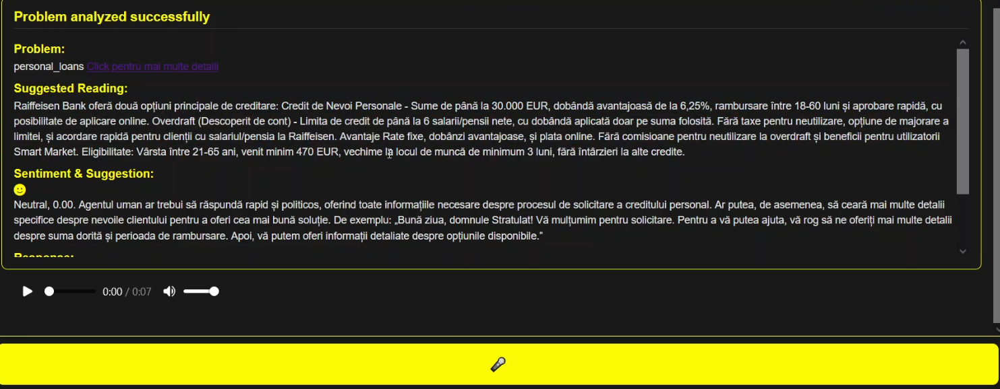
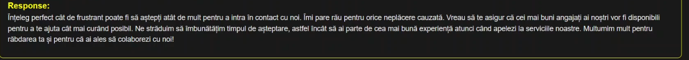
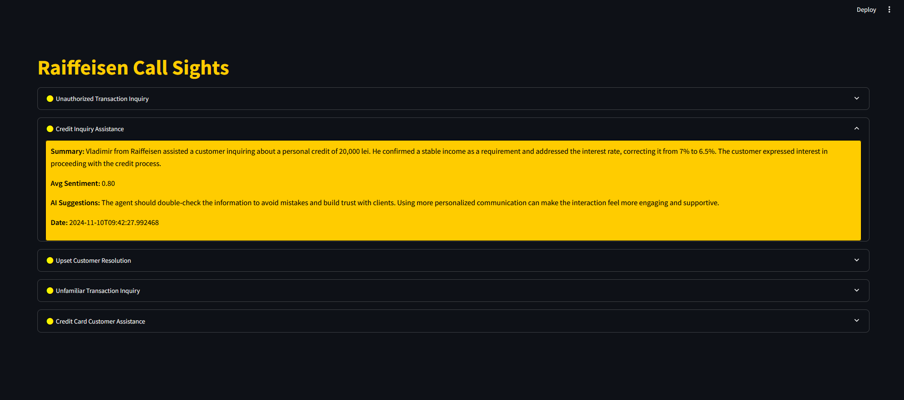

# Call Sights - Winner Project for NEXXT AI Hackathon by Raiffeisen Bank

## Features

### 1. Client Request Analysis
When an audio recording of a client is sent to the system, Call Sights:
- Processes the audio using the Whisper API to transcribe the spoken content into text.
- Generates an analysis report containing key insights and suggestions to assist the human call center agent.
- Generates text to speech voice that gives a detailed and personalized response to the user.

#### Examples:
-  – Analysis report for a neutral client, offering suggestions and a summary.
-  – Text-to-speech response generated for an angry client, providing a calm and tailored reply.

### 2. Manager Dashboard on Calls Analysis
Call Sights offers a dashboard for managers to monitor and analyze interactions handled by each call center agent:
- Provides insights into agent performance and interaction history.
- Displays detailed reports for each call after the initial analysis, allowing managers to track and improve team efficiency.
 - An AI agent gives a detailed analysis of the conversation

## Technology Stack
- **Whisper API**: Used for high-quality transcription of call audio.
- **Streamlit, Vanilla JavaScript**: For interactivity and showcasing.
- **Python** and **FastAPI**: Backend for processing calls and generating reports.
- **PostgreSQL**: Database for storing interactions and reports.

### 3. Video Demo
[Watch the demo video here](project_presentation/BITSTORM_CALL_SIGHTS.mp4)
